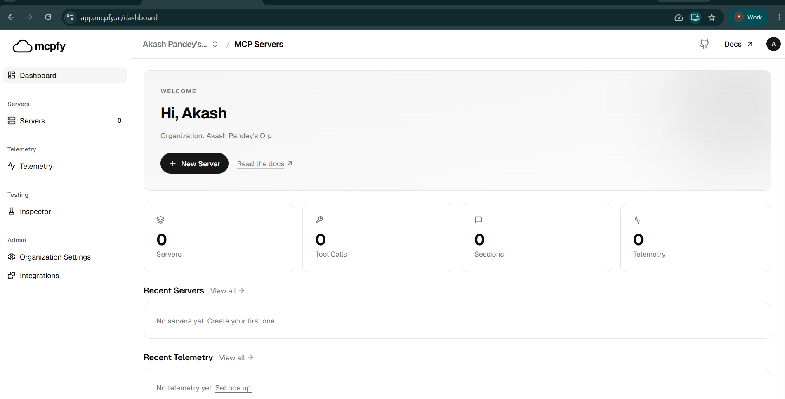
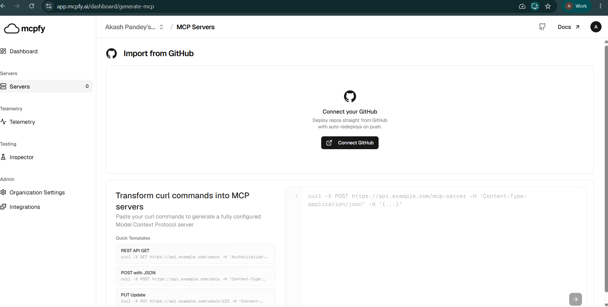
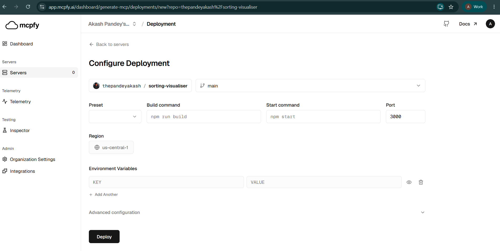
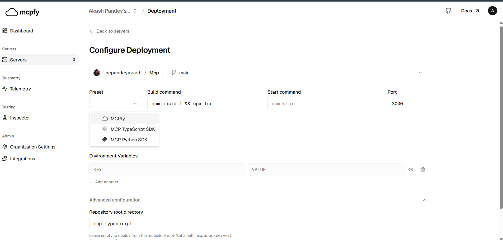
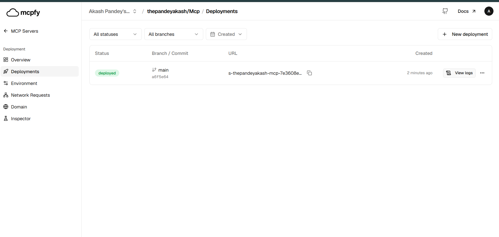

# Deploy an MCP Server Using GitHub and Mcpfy

Mcpfy lets you deploy an MCP server from a GitHub repository and make it available as a hosted MCP endpoint.

This guide walks you through the deployment process, from connecting your GitHub repository to configuring and deploying your MCP server.

> **Note:** The screenshots in this guide use an example MCP server. Your repository name, project directory, branch, build command, start command, environment variables, port, and other configuration values may be different. Use the values required by your own project.

## Prerequisites

Before you begin, make sure you have:

- A Mcpfy account
- A GitHub account
- An MCP server project
- Your MCP server code pushed to a GitHub repository
- A Git branch containing the code you want to deploy
- Any environment variables or secrets required by your server

> **Tip:** It is recommended that you verify your MCP server builds and runs successfully in your local environment before deploying it.

---

## 1. Open the Mcpfy Dashboard

Sign in to your Mcpfy account and open the dashboard.

From the dashboard, go to **Servers** and select **New Server**.



Selecting **New Server** starts the deployment setup process.

---

## 2. Import Your Server from GitHub

On the server creation page, select **Import from GitHub**.



Select **Connect GitHub** and authorize Mcpfy to access the repositories required for your deployment.

After GitHub is connected, select the repository that contains your MCP server.

> **Important:** Use your own GitHub repository. The repository shown in the screenshot is only an example.

---

## 3. Configure Your Deployment

After selecting your repository, Mcpfy opens the deployment configuration page.

This is where you specify how Mcpfy should build and run your MCP server.



The exact values you enter depend on your MCP server. The sections below explain what each setting is used for.

### Repository

Select the GitHub repository containing your MCP server.

For example:

```
your-github-username / your-mcp-server
```

> **Note:** The repository shown in the screenshot is only an example.

### Branch

Select the Git branch containing the version of your server that you want to deploy.

For example:

```
main
```

You can use a different branch if your project uses one.

> **Tip:** Make sure the selected branch contains the code and configuration required to build and run your MCP server.

---

## 4. Select the Appropriate Preset

Select the preset that matches the technology used by your MCP server.

Open the **Preset** field to see the available options.



For example, Mcpfy may provide presets for supported MCP implementations such as:

- MCP TypeScript SDK
- MCP Python SDK

Choose the preset appropriate for your project.

> **Important:** Do not copy the preset from the example deployment unless it matches your own MCP server.

---

## 5. Configure the Repository Root Directory

The **Repository Root Directory** tells Mcpfy which directory should be treated as the root of your application.

This is useful when your MCP server is inside a subdirectory of a larger repository.

For example:

```
my-repository/
├── mcp-server/
│   ├── package.json
│   ├── src/
│   └── tsconfig.json
│
└── another-project/
```

If your MCP server is located inside `mcp-server`, enter:

```
mcp-server
```

as the repository root directory.


If your MCP server is located directly at the root of the repository, leave the repository root directory empty.

For example:

```
my-repository/
├── package.json
├── src/
└── tsconfig.json
```

> **Tip:** If Mcpfy cannot find files such as `package.json` or your source code during deployment, check that the repository root directory points to the correct location.

---

## 6. Configure the Build Command

The **Build Command** tells Mcpfy how to prepare your application before it starts.

The correct command depends on your project's runtime and build configuration.

For example, a TypeScript project might use:

```
npm install && npx tsc
```

Another project might define a build script in `package.json`:

```json
{
  "scripts": {
    "build": "tsc"
  }
}
```

In that case, you can use:

```
npm run build
```

Use the build command defined by your own project.

> **Tip:** Check your `package.json`, project documentation, or local development workflow to determine the correct build command. If the command works locally, it is a good starting point for your deployment configuration.

---

## 7. Configure the Start Command

The **Start Command** tells Mcpfy how to start your MCP server after the build completes.

For example:

```
npm start
```

or:

```
node dist/index.js
```

The correct command depends on how your project is configured.

If your `package.json` contains:

```json
{
  "scripts": {
    "start": "node dist/index.js"
  }
}
```

you can use:

```
npm start
```

> **Important:** Make sure the start command actually starts your MCP server. Test it locally before deploying.

---

## 8. Configure the Port

Enter the port on which your MCP server listens.

For example:

```
3000
```

The value shown above is only an example.

Use the port configured by your application. If your server obtains its port from an environment variable or another configuration value, make sure it matches the deployment configuration.

---

## 9. Select a Region

Select the deployment region available for your application.

Choose the region appropriate for your deployment requirements.

> **Note:** The region shown in the example screenshot is not a required value. Your deployment may use a different region.

---

## 10. Configure Environment Variables

If your MCP server requires environment variables, add them through the **Environment Variables** section.

For example:

| Key            | Value                           |
| -------------- | ------------------------------- |
| `API_KEY`      | Your API key                    |
| `DATABASE_URL` | Your database connection string |

These are examples only. Your MCP server may require different variables.

To find the variables required by your project, check:

- `.env.example`
- Your project README
- Your application configuration
- The source code where environment variables are accessed

For example, if your application uses:

```javascript
process.env.GOOGLE_API_KEY
```

you would configure:

```
GOOGLE_API_KEY=<your value>
```

in the deployment environment.

> **Security:** Do not commit API keys, passwords, tokens, or other sensitive values to GitHub. Configure secrets through the deployment environment instead.

If your server does not require environment variables, you can leave this section empty.

---

## 11. Review Your Configuration

Before deploying, review the configuration you entered.

Check that:

- [ ] The correct repository is selected.
- [ ] The correct branch is selected.
- [ ] The preset matches your MCP server.
- [ ] The repository root directory is correct, if applicable.
- [ ] The build command matches your project.
- [ ] The start command matches your project.
- [ ] The port matches your server configuration.
- [ ] Required environment variables are configured.
- [ ] The selected region is appropriate.


---

## 12. Deploy Your MCP Server

Once you have reviewed your configuration, select **Deploy**.

Mcpfy will build your project and start the deployment using the configuration you provided.

You can monitor the deployment from the deployment page.

---

## 13. Monitor the Deployment

After deployment starts, Mcpfy displays information about the deployment, including its status, branch, commit, deployment URL, and logs.



A successful deployment shows the appropriate deployed status.

If the deployment fails, open the deployment logs to identify the cause of the failure.

---

## 14. Get Your MCP Endpoint

After a successful deployment, Mcpfy provides an endpoint for your deployed MCP server.

The endpoint generally follows this format:

```
https://<deployment-url>/mcp
```

Use the endpoint provided by your deployment.

> **Important:** The `/mcp` endpoint is an MCP protocol endpoint, not a conventional webpage. Opening it directly in a browser may return `Method Not Allowed`. This does not necessarily mean that the deployment has failed.

Use Mcpfy Inspector or another MCP-compatible client to connect to and test your deployed server.

---

## 15. Test Your Deployed MCP Server

After deployment, connect to the MCP endpoint using Mcpfy Inspector or another MCP-compatible client.

Verify that:

- [ ] The client can connect to your MCP endpoint.
- [ ] Your server's tools can be discovered.
- [ ] Your tools can be executed successfully.
- [ ] Your resources can be discovered, if your server exposes resources.
- [ ] The returned results are correct.

The tools and resources available depend on your MCP server implementation.

**Example:** If your server exposes an `add` tool, you should be able to discover and execute that tool through the Inspector. Your own server may expose completely different tools and resources.

---

## Automatic Deployments

Once your GitHub repository is connected to a deployment, changes pushed to the configured branch can trigger a new deployment.

The general workflow is:

```
Make changes to your MCP server
        ↓
Commit the changes
        ↓
Push to GitHub
        ↓
Mcpfy detects the repository update
        ↓
Build
        ↓
Deploy
        ↓
Updated MCP server
```

For example:

```bash
git add .
git commit -m "Update MCP server"
git push origin main
```

The branch shown above is only an example. Push your changes to the branch configured for your deployment.

This allows your GitHub repository to remain the source of truth for the deployed MCP server.

---

## Verify Your Deployment

After deployment, use the following checks to confirm that your server is working correctly:

| Check              | What to verify                                       |
| ------------------ | ---------------------------------------------------- |
| Deployment status  | The deployment completed successfully                |
| Deployment logs    | There are no build or runtime errors                 |
| MCP endpoint       | An endpoint is available for the deployment          |
| MCP connection     | An MCP-compatible client can connect                 |
| Tool discovery     | Your expected tools are available                    |
| Tool execution     | Your tools return the expected results               |
| Resource discovery | Your expected resources are available, if applicable |

A successful deployment status confirms that the deployment completed. Connecting through an MCP-compatible client provides the most useful functional verification.

---

## Troubleshooting

### Deployment fails during the build

Check:

- The build command is correct for your project.
- The selected branch contains the required source files.
- The repository root directory is correct.
- Your project configuration is valid.
- Required dependencies are available.
- The selected preset/runtime matches your project.
- The deployment logs for the specific error.

> **Tip:** As a first step, try running the same build command locally.

### Mcpfy cannot find project files

If Mcpfy reports that files such as `package.json` or your source files cannot be found, check the **Repository Root Directory**.

If your MCP server is inside a subdirectory:

```
repository/
└── mcp-server/
    ├── package.json
    └── src/
```

set the repository root directory to:

```
mcp-server
```

If your MCP server is already at the repository root, leave the field empty.

### Deployment starts but the server does not run

Check:

- The start command is correct.
- The server starts successfully when run locally.
- The server is listening on the configured port.
- Required environment variables are configured.
- The deployment logs do not contain runtime errors.

### Environment variable errors

If your server reports a missing API key, token, URL, or other configuration value:

1. Identify the environment variable required by your application.
2. Open the deployment's environment configuration.
3. Add the variable using the exact name expected by your application.
4. Provide the required value.
5. Redeploy if required.

### Browser shows "Method Not Allowed"

The MCP endpoint is designed for MCP protocol communication rather than normal browser navigation.

Use Mcpfy Inspector or another MCP-compatible client to test the endpoint.

### Tools are not available

If your server is deployed but the expected tools are not available:

1. Confirm that the correct repository was deployed.
2. Confirm that the correct branch was selected.
3. Check the repository root directory.
4. Check the deployment logs.
5. Confirm that the server started successfully.
6. Confirm that you are connecting to the correct MCP endpoint.
7. Check the tools registered by your server.

The tools available depend on your MCP server implementation.

### Deployment is using old code

Make sure your latest changes were pushed to the branch configured for the deployment.

For example:

```bash
git status
git add .
git commit -m "Update MCP server"
git push origin main
```

Then check the deployment history in Mcpfy and confirm that a deployment was triggered using the latest commit.

---

## Summary

Deploying an MCP server with Mcpfy involves:

```
GitHub repository
       ↓
Connect GitHub to Mcpfy
       ↓
Select your repository and branch
       ↓
Configure deployment
       ↓
Configure preset and project settings
       ↓
Configure environment variables
       ↓
Configure repository root if needed
       ↓
Deploy
       ↓
Get MCP endpoint
       ↓
Test with an MCP-compatible client
       ↓
Push future changes to GitHub
       ↓
Updated deployment
```

Mcpfy provides a Git-based workflow for deploying and updating MCP servers, allowing changes pushed to the configured repository branch to flow through the deployment process.
